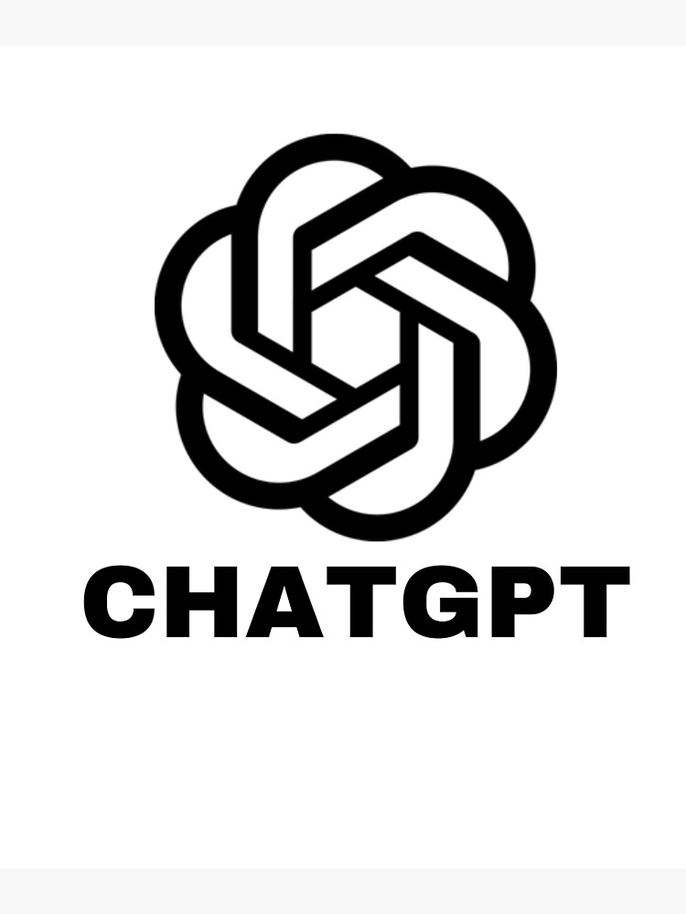

# ChatGPT_Project_Clone

Nesse repositorio teremos um clone do Chatgpt feito em aulas praticas ministradas pelo professor Felipe da Dio.me, onde aprendemos como criar e personalizar um projeto do zero!

## ⚛️ Tecnologias utilizadas
- JavaScript 
- Node

## 📚 Bibliotecas e Dependências

- openAI - Para integração com algoritmos openAI
- express - Para criar APIs de descanso com mais
- cors - Controlar o acesso a solicitações/recursos de API
- dotenv - Arquivo personalizado de configuração
- nodemon - Servidor de monitoramento de nós para desenvolvimento

## 🔧 Funcionalidades
- Api estruturada com o propósito de ser um clone o mais fiel possível do propio Chatgpt, o mesmo consumira e devolverá informações pesquisadas para o usuários.

